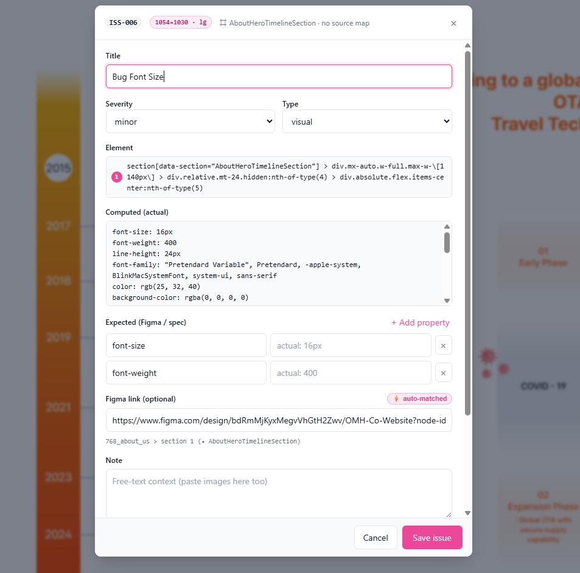
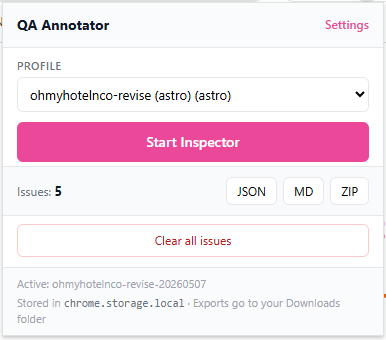
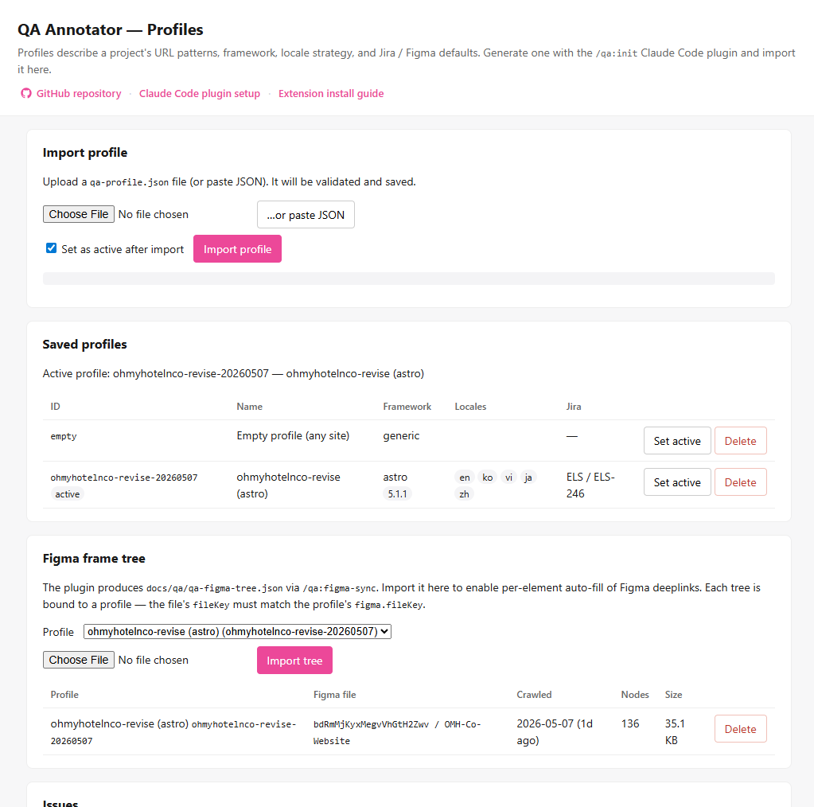
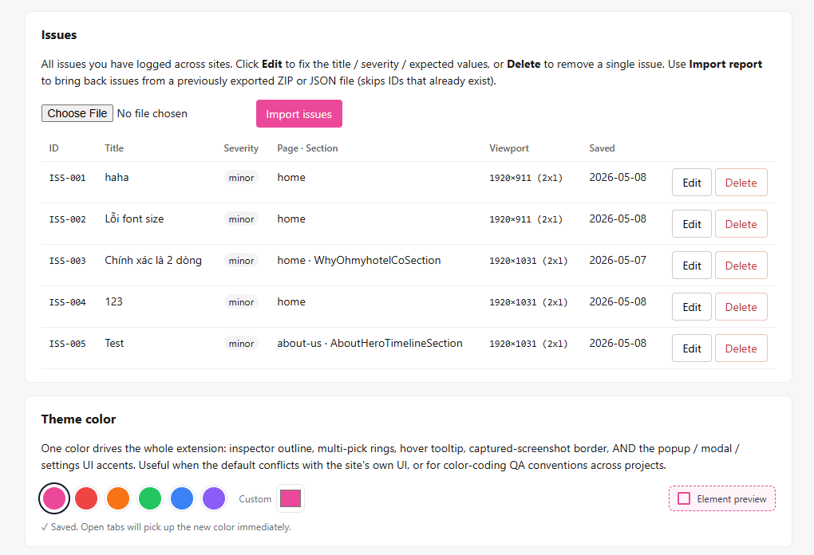

# QA Annotator

> Click any element on a live site → log a QA issue with computed styles, a cropped screenshot, and a deeplink to the matching Figma frame. Sync to Jira via Claude Code.

<p align="center">
  
</p>

Two pieces, one repo:

| Piece | What it is | Audience |
|---|---|---|
| **Chrome extension** (this repo, root) | Inspector overlay + form modal + ZIP export. Multi-pick (shift-click), auto-cropped screenshots, **canvas annotation editor** (numbered pin / arrow / rect / blur / text / freehand), **6 QA modes** (PROD-bug / Design-fidelity / Admin / A11y / i18n / Custom), **console + network capture**, **axe-core a11y scan**, multi-image gallery, auto-filled Figma links. | QA engineers |
| **Claude Code plugin** ([`plugins/qa-tooling/`](plugins/qa-tooling/README.md)) | `/qa:init` auto-detects project stack and generates `qa-profile.json`. `/qa:figma-sync` crawls Figma file. `/qa:sync` pushes QA reports into Jira via MCP. | Dev / QA leads |

Both pieces share two JSON files: **`qa-profile.json`** (project conventions) and **`qa-figma-tree.json`** (cached Figma frame tree). Plugin generates them; extension consumes them.

---

## Install

### Extension

**For QA team (no git, no clone):** download the latest ZIP from [Releases](https://github.com/dongquoctien/qa-annotator-extension/releases/latest), unzip, then in Chrome:
1. Open `chrome://extensions` → enable **Developer mode**.
2. Click **Load unpacked** → select the unzipped folder.
3. Pin the **QA Annotator** icon to the toolbar.

**For devs (clone + load source):** clone this repo, then **Load unpacked** → select the repo root.

Either way: click the icon → **Settings** → import a `qa-profile.json` from any project, then optionally import its `qa-figma-tree.json`.

Without imports, the extension uses the bundled empty profile and works on any URL — just no source mapping or Figma auto-fill. See [`docs/INSTALL.md`](docs/INSTALL.md) for the full workflow + storage layout.

### Plugin (recommended — Claude Code marketplace)

In a Claude Code session at any project:

```
/plugin marketplace add dongquoctien/qa-annotator-extension
/plugin install qa-tooling@qa-annotator
```

Then run `/qa:init` to generate `docs/qa/qa-profile.json`. To update: `/plugin marketplace update qa-annotator`.

See [`plugins/qa-tooling/README.md`](plugins/qa-tooling/README.md) for all four commands. Manual install (no marketplace) instructions also there.

---

## Daily workflow

```
1. QA opens target site → starts Inspector → clicks elements
2. Each click: modal opens with auto-captured cropped screenshot
                    + auto-filled Figma deeplink (when tree imported)
                    + per-element computed styles
3. QA fills Title / Severity / Expected → Save
4. End of session: popup → Export ZIP
5. Dev runs /qa:sync → Jira sub-tasks created
```

### Toolbar popup

Pick the active profile, start the Inspector, and export reports as JSON / Markdown / ZIP.

<p align="center">
  
</p>

### Settings — profiles, Figma trees, theme

Import a `qa-profile.json` and a `qa-figma-tree.json` per project. The active profile drives URL detection, locale strategy, and Figma auto-fill.

<p align="center">
  
</p>

### Settings — saved issues + report import

Edit / delete saved issues without re-picking. Re-import a previously exported ZIP or JSON to bring issues back (skips duplicate IDs).

<p align="center">
  
</p>

---

## Keyboard / mouse shortcuts (in-page)

| Action | Shortcut |
|---|---|
| Stop inspector | `Esc` |
| Pick single element | Click |
| Add to multi-pick set | `Shift` + Click |
| Commit multi-pick (open modal) | Press **Done** button or `Enter` |
| Paste image into modal | `Ctrl/Cmd` + `V` anywhere in modal |
| Close modal | `Esc`, header `×`, footer **Cancel**, or click backdrop |

---

## More docs

| Doc | What |
|---|---|
| [`STATUS.md`](STATUS.md) | What's built · what's not · known limitations · bugs caught + fixed |
| [`CLAUDE.md`](CLAUDE.md) | Codebase guide for Claude Code in future sessions — architecture, conventions, gotchas |
| [`docs/INSTALL.md`](docs/INSTALL.md) | Extension install + workflow + chrome.storage details |
| [`docs/DEPLOY.md`](docs/DEPLOY.md) | Deploying plugin + extension (load unpacked, future Web Store) |
| [`plugins/qa-tooling/README.md`](plugins/qa-tooling/README.md) | Plugin commands · skills · install in another project |
| [`docs/archive/`](docs/archive/) | Original Phase 1 design docs (PLAN, PLUGIN_PLAN, SUMMARY, FLOWCHARTS) |

---

## What's new in v0.3.0 (2026-05-08)

- **Mode-aware modal panels** — each QA mode shows the right form fields. No more generic Note + Expected CSS rows for every bug type:
  - **prod-bug** → Runtime context (numbered repro steps + expected vs actual + auto-attached console + network + browser env)
  - **design-fidelity** → Mismatch category radio (spacing/color/typography/alignment/asset/other) + Figma reference (auto-matched link + breadcrumb)
  - **admin** → App state (role/tenant auto-detected from `data-user-role`/`data-tenant-id`, route from URL, modal data-id) + Runtime context
  - **a11y** → Rich axe-core display: violations with WCAG SC + helpUrl + impact, contrast ratio with swatches, affected user group dropdown, fix suggestion
  - **i18n** → Locale + direction (auto from `document.dir`) + bug category (truncation/mirroring/hardcoded/plural/format/translation/missing) + source vs rendered string + linguistic vs technical
- **Pin notes panel** — universal across all modes. Every numbered pin gets a textarea grouped by screenshot. Round-trip lossless with the annotation editor.
- **Custom mode panels preset** — Settings card lets you pick which panels show in Custom mode (empty = all 6 panels collapsed).
- **Panel-aware Markdown / ZIP / JSON export** — each panel emits its own block. Pin notes render as bullet list with 📍 emoji. Empty panels skip silently to keep reports compact.

## What's new in v0.2.0 (2026-05-08)

- **6 QA modes** (PROD bug / Design fidelity / Admin / A11y / i18n / Custom) — picker in Settings auto-toggles capture sources + filters which Settings cards are visible to keep the UI focused per workflow.
- **Annotation editor** opens after capture: drop **numbered pins** (auto-increment), draw **rectangles** (red=bug / green=expected / accent=info), arrows, text callouts, blur for PII, freehand pen. Undo / Redo. Re-editable from saved issues.
- **Console + network capture** — page-world ring buffer attaches the last 50 console errors + 20 failed requests + browser env to each issue (toggleable per mode). Privacy redact patterns scrub bodies before storage.
- **Accessibility scan** — bundled axe-core runs scoped to the picked element; violations + WCAG SC + helpUrl render in the modal. Inspector tooltip shows live contrast ratio in a11y mode.
- **Issue defaults** — title template substitution, URL-regex auto-tags, severity hotkeys (1/2/3/4), required-field validation gate.
- **Mode + pin count UX** — popup + modal headers show active mode chip and total pin count. Per-thumbnail pin/annotation badges.

## Status

- **Extension** v0.3.0 — Phase 1 + Sprint 1 + Sprint 2 (mode-aware modal panels, all 5 mode-specific panels + universal pin-notes, exporter rendering panels) complete and tested live via chrome-devtools MCP.
- **Plugin** Phase 1 complete; `/qa:init`, `/qa:doctor`, `/qa:figma-sync` exercised live against about-us; `/qa:sync` spec done but not yet exercised against a real Jira workspace.

Phase 2 (mode-aware modal panels for runtime context / app-state / a11y findings / i18n findings) listed in [`STATUS.md`](STATUS.md#-not-built-phase-2).
